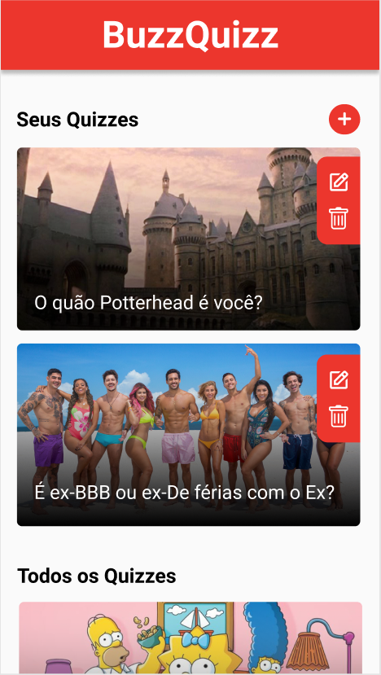

<h1 align="center">
    
</h1>

<h1 align="center">
    <a href="#">BuzzQuizz</a>
</h1>

  
   
   

<h4 align="center"> 
	 Status: Delivered.
</h4>

## About

BuzzQuizz is a cool & efficient way to create and answer quizzes.  
Project developed during ** Bootcamp Responde Aí ** offered by [Responde Aí](https://www.respondeai.com.br/).  
The focus of this project is to further develop Front End skills using HTML5, CSS3 and pure JavaScript.

---

## Features

- [x] Layout:
   - [x] Mobile;
   - [x] Desktop;

- [x] Homepage experience:
   - [x] Loads available quizzes;
   - [x] If you made a quizz, it will render seperately;
   - [x] The quizzes you made have an edit and a delete button;

- [x] Quizz experience
   - [x] Slides the quizz page into view when clicked;
   - [x] Shows correct answer when clicked;
   - [x] Auto scrolls questions;
   - [x] Calculates % of right answers;
   - [x] Displays final message equivalent to %;
   - [x] Replay quizz or Back home buttons;
   
- [x] Creating Quizz
   - [x] Input validations (question size, valid URL & others);
   - [x] Displays the correct amount of questions & levels;
   - [x] When finished, renders the new quizz created;
   - [x] Adds quizz to the Your Quizzes list;
---

## Layout

The application layout is available on Figma:

### Mobile

  
  

  
  

### Desktop

## Tech Used

The following tools were used in the construction of the project:

-   ****
-   ****
-   ****

#### **Utilities**

-   Prototype:  **[Figma](https://www.figma.com/)**  →  **[Protótipo (Bate Papo)](https://www.figma.com/file/nCuPD1re0r4EAwNl7OCNvz/BuzzQuizz---Turma-02?node-id=0%3A1)**
-   Editor:  **[Visual Studio Code](https://code.visualstudio.com/)**
-   Icons:  **[Ion Icons](https://ionicons.com/)**
-   Fonts:  **[Roboto](https://fonts.google.com/specimen/Roboto)**

---

## Authors

<a style="border-radius: 50px;" width="100px;" href="https://github.com/lucasmoraismt">
 
  
 <b>Lucas de Morais</b></a>
  

<a style="border-radius: 50px;" width="100px;" href="https://github.com/ptrkc">
 
  
 <b>Patrick Carneiro</b></a>
  

---

## License

This project is under the license [MIT](./LICENSE).

👋🏽 Get in Touch!

---
